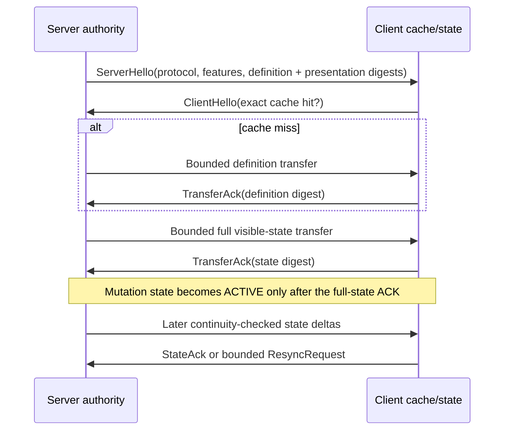

# Networking and Client Projection

Status: Phase 6 accepted after automated protocol and security checks plus the real client checkpoint.

## Authority and handshake

The server remains the only progression authority. NeoForge first negotiates the non-optional registrar version (`1`), then ProgressiveSkills performs a play-phase application handshake with protocol version `1` and a required feature bitset. The server hello includes:

- a persistent random world/server UUID plus an ephemeral connection session UUID;
- gameplay definition generation and semantic SHA-256;
- presentation revision and SHA-256 of the exact sanitized projection bytes;
- the closed required-feature set and projected-definition count.

The client cache key contains its stable selected destination (a `singleplayer` marker or a SHA-256 fingerprint of the normalized server-list address), the persistent server identity, protocol version, semantic digest, and presentation digest. It never uses Minecraft's temporary local transport id, which changes when an integrated world is reopened. A cache hit is inactive until the new server hello proves that exact tuple. Only sanitized definitions survive disconnect, in an eight-entry/24-hour in-memory LRU; player state, session state, transfers, and request results are cleared. `ClientNetworkState.clearDefinitionCache()` is the side-neutral clear-cache control for the later client settings screen.

Login and respawn begin this flow after attachment restore/reconciliation. Dimension changes begin a new session but ordinarily reuse the exact cached definition projection. Publishing a reviewed pack generation reconciles online attachments and invalidates every old session/digest before starting a fresh handshake.

## Sanitized definition projection

`DefinitionProjection` is constructed from canonical IR and contains only:

- typed definition identity;
- bounded localization key plus fallback for display/description;
- bounded icon kind/references/fallback/alt/narration;
- bounded presentation search aliases.

Gameplay fields, costs, rules, commands, hidden server values, provenance, source paths, merge metadata, and source maps have no field in this DTO or its codec. Tests encode a definition containing server-only cost/command/provenance strings and prove none enter the wire bytes.

## Transfer and payload ceilings

Definitions and full visible state share one compressed, chunked envelope. The start payload declares session/transfer UUIDs, closed transfer kind, compressed and uncompressed byte counts, chunk count, and uncompressed SHA-256. Chunks may arrive out of order; exact duplicates are harmless, conflicting duplicates fail closed. Activation occurs only after all bytes, exact lengths, decompression cap, and digest pass atomically.

| Contract | Hard ceiling |
|---|---:|
| Definition count | 4,096 |
| Sanitized definition bytes | 2 MiB uncompressed |
| Full visible state | 1 MiB uncompressed |
| Compressed transfer aggregate | 3 MiB |
| Chunk body | 24 KiB |
| Chunks per transfer | 128 |
| Concurrent incoming transfers | 2 |
| Delta payload | 64 KiB |
| ProgressiveSkills serverbound payload | 16 KiB (below NeoForge's less-than-32-KiB limit) |
| Intent text | 2 KiB |
| Transfer/session ACK timeout | 30 seconds |

Every collection/string length is checked before allocation. Enum ordinals fail closed, transfer output is capped while inflating, trailing bytes are rejected, and no serverbound chunk/file endpoint exists. A failed definition/full-state transfer is retried at most once; a second failure or a timed-out handshake disconnects with a bounded friendly reconnect message.

## Full state and semantic deltas

The full owner-visible state contains storage/sync revision, transaction state revision, gameplay definition generation/digest, presentation revision/digest, bounded balance/effective-value maps, orphan/operation-receipt counts, and quarantine status. Durable receipt bodies, idempotency results, audits, raw attachment data, and orphan payloads remain server-only.

After activation, an attachment revision increase normally produces one semantic delta with exact `baseRevision -> newRevision`, new transaction revision, closed changed/removed balance and effective-value sets, diagnostic counts, and resulting full-state SHA-256. The client applies only an exact player/generation/presentation/base continuation. A gap, out-of-order edge, malformed body, or result-digest mismatch requests a bounded full snapshot. An already-applied identical delta is ACKed without applying twice. A delta over 64 KiB falls back to the same bounded full-state envelope.

## Serverbound intent safety

The only Phase 6 intent is a non-mutating `NOOP_TEST` used by automated protocol tests; gameplay intent types arrive with their owning feature phases. Every intent carries the active session, monotonic request ID, definition generation/digest, and authoritative state revision. The server:

- returns the exact cached result/result UUID for a retained duplicate;
- rejects an uncached request at or below the highest request ID;
- rejects a future jump over 1,024;
- stores at most 64 request results per connection;
- enforces a per-player 20-token bucket refilled at 10 intents/second;
- rejects stale definition/state revisions and sends a targeted full resync;
- derives all validity, costs, amounts, targets, and effects from server authority.

Reconnect-safe value delivery uses durable transaction receipts and the bounded retained transaction-result window. The ephemeral connection replay cache handles in-session duplicates and rejects requests older than its retained window.

## Lifecycle and operator commands

| Event | Result |
|---|---|
| Login | Restore/reconcile attachment, then start handshake and full state. |
| Transaction commit | Persist first, then send a delta when the session is active. |
| Respawn | Restore/reproject, then start a full digest-bound session. |
| Dimension change | Start a new session; exact definition cache hits avoid definition upload. |
| Published reload | Reconcile every online player and replace all old sessions/digests. |
| Logout/server stop | Remove server session; client clears all authority on disconnect. |

`/ps network status` reports handshake phase, protocol, digest prefixes, definition-cache hit, sent/ACKed revisions, delta/resync counts, and replay-cache size. `/ps network resync` (permission 4) deliberately starts a fresh session without mutating progression.

## Manual in-game checkpoint

Use the same cheats-enabled client/world used for Phase 5:

1. Join and run `/ps network status`. Expect `Protocol 1 session ACTIVE`, matching sent/acknowledged storage revisions, and no timeout/rejection.
2. Run `/ps lifecycle demo`, then `/ps network status`. If this world's stable demo transaction was already used, use the existing lifecycle commands to create one fresh committed mutation (for example co-owner/revoke). Expect the delta count to increase and sent/acknowledged storage revisions to match.
3. Save and quit to the title screen, reopen the same world, and run `/ps network status`. Expect `ACTIVE` and `Definition cache hit true`; no player authority should have crossed the disconnect.
4. Run `/ps reload --dry-run`, review `/ps diff`, then `/ps reload --publish`. Run `/ps network status` after the ACK. Expect the new definition generation in an `ACTIVE` session with matching sent/acknowledged revisions.
5. Run `/ps network resync`, wait one moment, and run `/ps network status`. Expect a fresh `ACTIVE` session rather than duplicated progression, inventory, or health changes.

Packet corruption, oversized lengths, unknown enum ordinals, decompression bombs, stale/future/old/rate-limited intents, chunk reordering/conflicts, digest mismatches, replay identity, and delta gaps are automated because manually forging them would require an unsafe custom client.
